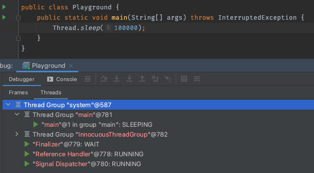

Java's Concurrency - 1 (Basic)

## ⒈ Background

블로그 스터디원 중 한 분이 Java로 개발할 때 Thread를 따로 만들어주지 않으면 그건 Single-Threaded application인가 라는 질문을 주셔서 간단하게 답해보고, 개발자가 어떻게 Thread를 생성할 수 있는지 간단하게 알아보려고 한다.

## ⒉ Is Java Single-Threaded application without explicitly created threads?

JVM이 실행될 때, 보통은 오직 하나의 `Non-Daemon Thread`(혹은 `User Thread`)가 존재하게 된다. 우리가 매일 같이 쓰고 있는 main method가 실행되는 main thread이다. `Daemon Thread`는 JVM에 의해서 background에서 실행되고 garbage collection나 finalizer같은 여러가지 task를 수행한다. 모든 Non-Daemon Thread가 완료되면 프로그램은 끝이 나지만, Daemon Thread의 완료는 프로그램의 종료를 의미 하지 않는다.

그렇다면 Java에서 Thread를 explicit하게 만들어주지 않으면 single-threaded application일까?

답은 Daemon Thread를 포함해서 답을 하는지에 따라 맞다 일 수도, 아니다 일 수도 있다.

예를 들어, 아래 코드처럼 Main method 안에 간단한 코드만 가지고 있을 때(Thread를 따로 생성하지 않았을 때!) 개발자의 입장에서는 single-threaded application이지만 실제로는 Non-Daemon Thread들이 실행 되고 있기 때문이다.

```java
  public static void main(String[] args) {
    System.out.println("Hello World!");
  }
```

참고로 Daemon Thread는 IDE의 디버거를 통해 쉽게 볼 수 있다.


_Non-Daemon Threads: Finalizer, Reference Handler, Single Dispatcher가 Daemon Thread에서 실행되고 있다_

## ⒊ How to create a thread in Java

Java에서 thread는 `Thread` 클래스에 의해 생성되는데, 이 클래스를 instantiate하는 두 가지 방법이 있다.

1. Extending `Thread` class ([documentation](https://docs.oracle.com/javase/7/docs/api/java/lang/Thread.html))
2. Implementing `Runnable` interface ([documentation](https://docs.oracle.com/javase/7/docs/api/java/lang/Runnable.html))

둘 중에 어떤 방법을 써야 할까? 실제로는 Runnable interface를 많이 쓰게 된다. Thread class를 extend 하게 되면 다른 클래스를 더 이상 extend 할 수 없기 때문에 Runnable interface를 implement하는 쪽이 조금 더 유연한 프로그램을 만들 수 있기 떄문이다.

## ⒋ Thread class

Thread class를 이용해 thread를 생성할 때에는 
1. Thread class를 extend한 후 
2. run method안에 실행 될 코드를 작성한다
3. Parent thread에서 작성한 클래스를 instantiation 후 
4. start method를 이용해 thread를 불러온다

> Note: Thread를 실행할 때, run이 아닌 start method를 호출한다. 자세한 내용은 밑([⒍ run() vs start()](#-run-vs-start))에서 알아볼 것이다. 

```java
class PrimeThread extends Thread { // 1. Thread class를 extend한 후 
    long minPrime;

    PrimeThread(long minPrime) {
        this.minPrime = minPrime;
    }

    public void run() {
        // 2. run method안에 실행 될 코드를 작성한다
        . . .
    }
}

class Main {
    public static void main(String[] args) {
        PrimeThread pt = new PrimeThread(143); // 3. Parent thread에서 작성한 클래스를 instantiation 후 
        pt.start(); // 4. start method를 이용해 thread를 불러온다
    }
}
```

## ⒌ Runnable Interface

Runnable interface를 이용해 thread를 생성할 때에는
1. Runnable interface를 implement한 후
2. run method안에 실행 될 코드를 작성한다
3. Parent thread에서 작성한 클래스를 instantiation 후 
4. Instantiate한 클래스를 새로운 Thread object를 이용해 implement 해준다
5. 새로 만들어진 Thread object를 start method로 불러준다

> Note: Runnable interface는 오직 run method 하나만을 가진 interface이고 Thread object를 통해 만들어질 새로운 thread에서 실행될 코드를 담는 역할만을 한다

```java
class PrimeRun implements Runnable { // 1. Runnable interface를 implement한 후
    long minPrime;
    PrimeRun(long minPrime) {
        this.minPrime = minPrime;
    }

    @Override
    public void run() {
        // 2. run method안에 실행 될 코드를 작성한다
        . . .
    }
}

class Main {
    public static void main(String[] args) {
        PrimeRun p = new PrimeRun(143); // 3. Parent thread에서 작성한 클래스를 instantiation 후 
        new Thread(p).start(); // 4. Instantiate한 클래스를 새로운 Thread object를 이용해 implement 해준다
                               // 5. 새로 만들어진 Thread object를 start method로 불러준다
    }
}
```

## ⒍ run() vs start()

위 코드들에서 봤듯이 thread를 실행시킬 때, 우리는 run 대신 start method를 이용한다. 그 이유는 간단한데, JVM이 start method가 불려질 때 새로운 thread를 만들기 때문이다. run method는 thread에서 실행될 코드에 불과하다. 실제 코드를 통해 간단하게 증명해 보도록 하자. 

먼저 Java documentation에 적혀 있는 내용을 한 번 보고 가자.

> It is never legal to start a thread more than once. In particular, a thread may not be restarted once it has completed execution  
&emsp;&emsp;Throws: `IllegalThreadStateException` - if the thread was already started.


자바의 thread는 한번 실행 되고 나면 다시 실행 될 수 없고 만약 다시 실행을 시도하면 exception을 던진다고 한다.\
다음 코드에는 Thread class를 extend한 PlaygroundChild class가 있고 그 걸 불러내는 Playground class가 존재한다. 그 안에서 run method와 start method를 두 번씩 실행 시켜 보았다. 만약 run method가 thread를 만든다면 두 번째 불려지는 run method는 IllegalThreadStateException을 던져야 한다.

결과는 어떨까?

```java
public class PlaygroundChild extends Thread {
    public void run() {
        // compute primes larger than minPrime
        for(int i = 0; i < 3; ++i) System.out.print(i + " ");
        System.out.println();        
    }
}

public class Playground {
    public static void main(String[] args) {
        PlaygroundChild pc = new PlaygroundChild();
        pc.run(); // 0 1 2 
        pc.run(); // 0 1 2 

        pc.start(); // 0 1 2
        pc.start(); /* Exception in thread "main" java.lang.IllegalThreadStateException
	                      at java.base/java.lang.Thread.start(Thread.java:794)
	                      at playground.Playground.main(Playground.java:10) */
    }
}
```

결론적으로, run method를 호출하면 thread가 만들어지지 않고 run method자체가 불려지고, start method를 통해서만 새로운 thread를 만들어낼 수 있다.


## ⒎ Retrospective

Thread를 만들 수 있는 방법에 대해서 다시 review 하고 Daemon Thread에 대해서 알아볼 수 있는 좋은 기회가 되었다. 이 글에 이어서 Java의 Concurrency에 대해서 조금 더 자세하게 공부하고 이어서 글을 써 봐야 겠다. 양이 워낙 방대해서 한 글에 담을 수가 없을 것 같아서 시리즈로 글을 써야 할 것 같다 😁


## ⒏ References
[Thread - Oracle](https://docs.oracle.com/javase/7/docs/api/)\
[Runnable - Oracle](https://docs.oracle.com/javase/7/docs/api/java/lang/Runnable.html)

